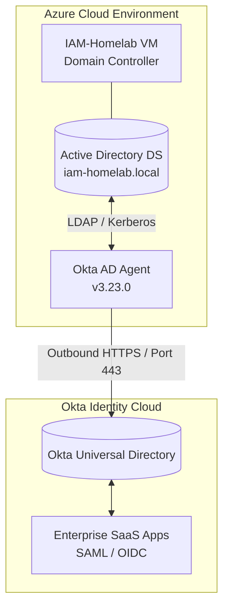
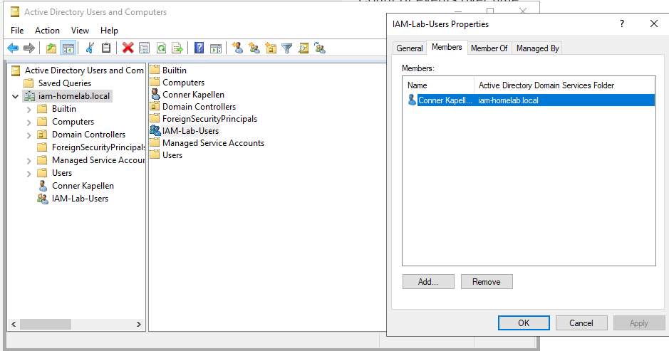
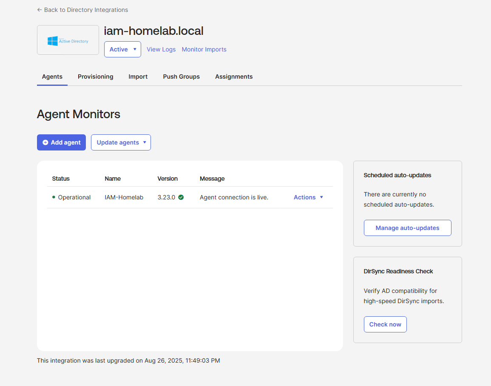
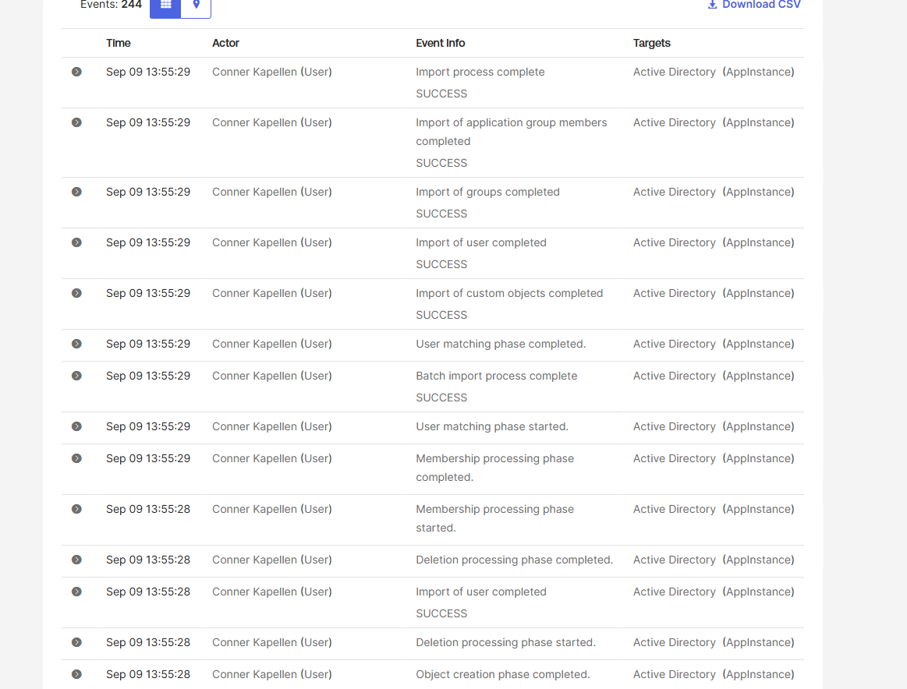
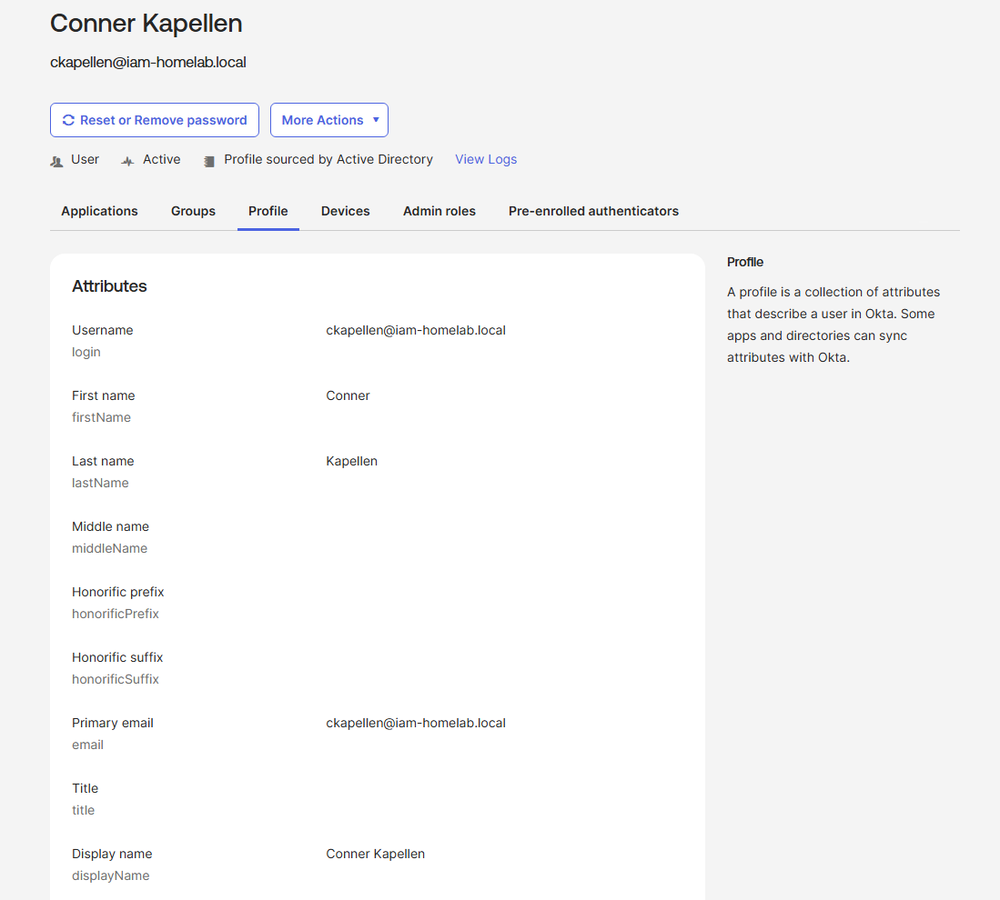
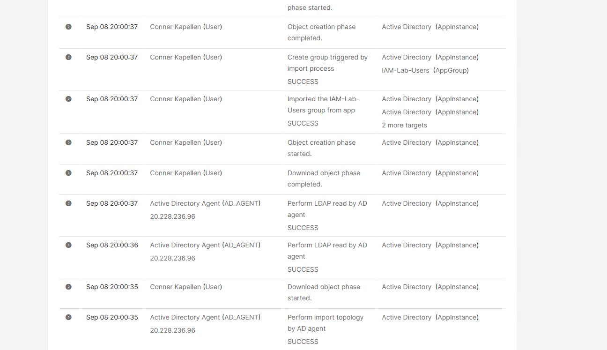
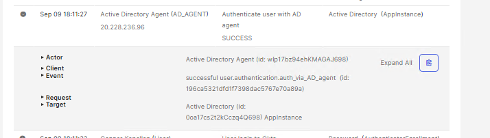
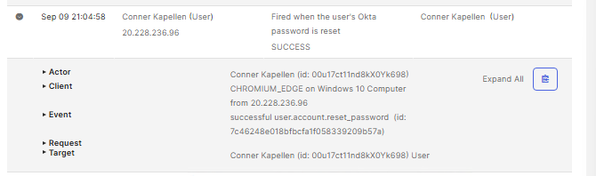

# IAM-Homelab
Hybrid Enterprise IAM Lab: Azure AD DS to Okta Identity Cloud Integration
# Hybrid Enterprise IAM Lab: Azure AD DS to Okta Identity Cloud Integration

## Overview
This project demonstrates the design, deployment, and configuration of an enterprise-grade hybrid identity architecture. An Active Directory Domain Services (AD DS) environment hosted on an Azure Virtual Machine serves as the primary Directory Source of Truth, integrated seamlessly with an Okta Identity Cloud tenant using the Okta AD Agent. 

The lab simulates real-world enterprise Identity and Access Management (IAM) workflows, including directory synchronization, schema mapping, delegated authentication, and automated lifecycle management.

---

## Technical Specifications & Stack
* **Directory Source of Truth:** Active Directory DS (`iam-homelab.local`)
* **Cloud Infrastructure:** Azure Virtual Machine (`IAM-Homelab`, Windows Server 2022)
* **Identity Provider (IdP):** Okta Universal Directory (Developer Edition)
* **Integration Component:** Okta Active Directory Agent (v3.23.0)
* **Protocol Support:** LDAP, Kerberos/NTLM (Delegated Auth), HTTPS (TLS 1.2/1.3 Outbound)

---

## Architecture & Data Flow

---

## Proof of Concept & Evidence

### 1. Active Directory Domain Controller Configuration
Active Directory OU structure, service accounts, and test users in `iam-homelab.local`:

### 2. Okta AD Agent Connectivity
Okta AD Agent v3.23.0 running on Azure VM with active outbound status:

### 3. User Reconciliation & Import
Matching and confirmation of imported Active Directory identities in Okta:

### 4. Active Synced User Profiles
Universal Directory user list displaying synced Active Directory source attributes:

### 5. Audit Logging & System Events
Okta System Log verifying automated user lifecycle and sync events:

---

## Bi-Directional Password Workflows & System Log Signatures

To verify that identity data flows seamlessly in both directions between Okta OIE and on-premises Active Directory, use the following log signatures for auditing:

| Direction | Workflow Type | Primary Actor | Key Event Signature | Description |
| :--- | :--- | :--- | :--- | :--- |
| **AD $\rightarrow$ Okta** | **Delegated Authentication** | `Active Directory Agent (AD_AGENT)` | `Authenticate user with AD agent` (`auth_via_AD_agent`) | Triggered when a user signs into Okta; Okta queries the on-premises domain controller via the agent to validate credentials. |
| **Okta $\rightarrow$ AD** | **SSPR Writeback** | End-User (`Conner Kapellen (User)`) | `Perform user password reset by AD agent` (`reset_user_password`) | Triggered when a user resets their password in Okta; Okta commands the AD agent to push the new password down into Active Directory. |

### Visual Log Reference

* **Inbound / Auth Validation (`07-okta-delauth-success-log.png`):** Demonstrates AD verifying user credentials upward during sign-in.
  
* **Outbound / Writeback (`okta-sspr-success-log.png`):** Demonstrates Okta successfully executing an SSPR writeback down through the agent into the domain.
  
